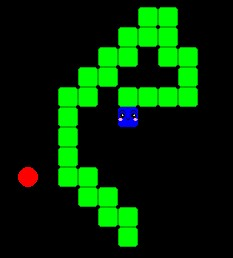

# Juego-Culebra-IA-Deep-Q-learning
Juego retro de la Culebra IA con Python, Tenserflow, Keras, Pygame. Ejercicio de aprendizaje de redes neuronales con Deep Q-learning

En el archivo *deepQlearning.py* se encuentran dos clases, **Agente** y **BufferDeReproduccion**, con la primera se hace la construccion del modelo, aprendizaje y prediccion y con la segunda se almacenan los datos relevantes en memoria para el aprendizaje.

Al ejecutar se puede elegir entre entrenar el modelo o ver a la culebra en accion, sin embargo para que funcione correctamente este ultimo ya se debe tener un modelo entrenado.

Se puede elegir en el entrenamiento visualizarlo o no, si no se vizualiza se ejecuta mas rapido.

Se usa **deep Q-learning** para entrenar el modelo, se le da recompensas por alcanzar las frutas y castigos por chocar con el cuerpo o las paredes, despues de al rededor de entrenarlo por unos 150 juegos, este es el resultado del aprendizaje.

Usando esta tecnica es muy improbable que llegue a completar el juego ya que solo actua de forma que se dirige a las frutas casi siempre, sin embargo es incapaz de generar alguna estrategia compleja cuando su cuerpo es muy largo.

La red neuronal consiste en 4 capas de 256 neuronas, con una funcion de activacion relu, el modelo se compila con un optimizador Adam.

El modelo entrenado (con los pesos ajustados) se guarda en el archivo *modeloDQN.h5*.

Las clases del archivo *deepQlearning.py* estan inspiradas en el video de *Machine Learning with Phil*, [Deep Q Learning is Simple with Keras | Tutorial](https://www.youtube.com/watch?v=5fHngyN8Qhw&t).

